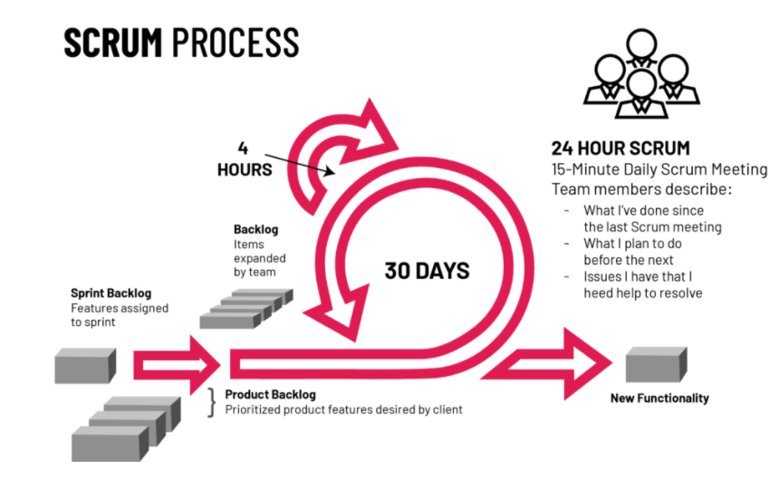
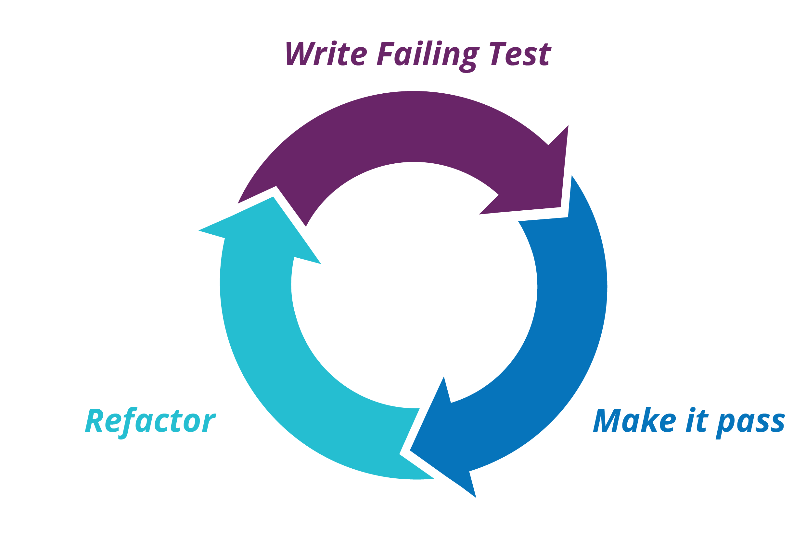

# Interview Prep (STAR)
## Reminder of STAR
__Situation__ what was the situation you were in?
__Task__ What was the task you needed to complete?
__Action__ What actions did you take? 
__Result__ How did your actions influence the outcome (What difference did you actions make? How did that lead to the successful completion of the task?)

## Questions

### Agile & SCRUM 

- What is Agile(STAR)
    - Agile software development refers to  software development methodologies centered round the idea of iterative development, where requirements and solutions evolve through collaboration between self-organizing cross-functional teams. [Source](https://www.cprime.com/resources/what-is-agile-what-is-scrum/)
    - STAR: we use Agile when we work on tasks, starting with a simple set of requirements / user stories to meet, complete with documentation and working code. THEN we increment, to improve the code. The tasks follow a short cycle, analogous to agile sprints. 
- What is Scrum(STAR)
    - Scrum is a subset of Agile. It is a lightweight process framework for agile development, and the most widely-used one. A Scrum process is distinguished from other agile processes by specific concepts and practices, divided into the three categories of Roles, Artifacts, and Time Boxes.[Source](https://www.cprime.com/resources/what-is-agile-what-is-scrum/)
    - STAR: we use scrum to manage our weekly workflow, we have a week sprint, daily sprint, and a stand-up (daily scrum) every morning, we also have sprint retrospective in the form of a test / review. 
- What is the difference between Agile and Scrum
    - Agile describes a set of guiding principles that uses iterative approach for software development, while Scrum is a specific structure / workflow which is used to implement Agile development.
- Three amigos refers to the primary perspectives to examine an increment of work before, during, and after development.
    - Business 
    - Development
    - Testing
- Persona:
    - defines an archetypical user of a system, an example of the kind of person who would interact with 
- What are SCRUM:
 
    -  Roles
        - **Scrum Master:** responsible for SCRUM process implementation
        - **Product Owner** responsible for defining Stories and prioritizing the Team Backlog to streamline the execution of program priorities while maintaining the conceptual and technical integrity of the Features or components for the team. [Souce](https://www.scaledagileframework.com/product-owner/)
        - **Team** self-organizing and cross-functional group of people who do the hands-on work of developing and testing the product.
    - Artifacts [Source](https://www.scrumalliance.org/about-scrum/artifacts#:~:text=Scrum%20defines%20three%20artifacts%3A%20Product,a%20potentially%20releasable%20product%20increment.):
        - Product Backlog: everything that needs to be done for the project
        - Sprint Backlog: tasks to be completed in the sprint
        - Potentially Releasable Product Increment at the end of the sprint
    - Events 
        - Sprint Planning
        - Daily Scrum
        - Sprint Review
        - Sprint Retrospective 

- Methodologies (Differences between them and use cases) [source](https://productivehut.com/v-model-agile-waterfall-spiral/):
    - V model:
        - The main idea in the V-Model is that development tasks and testing tasks are corresponding activities of equal importance, which is symbolized by the two sides of the “V”- At the base point of the V, the code is written. In the right-hand, upward-sloping branch of the V, testing and debugging is done.
        - 
    - Agile:
        - promotes development iterations throughout the life-cycle of the project.
        - charactrised by very quick cycles
    - Waterfall:
        - The main concept of this model is that only when one development level is completed will the next one be initiated.

- starfish retrospective 
    - aims to help teams reflect on varying degrees of actions and activities  rather than simply the traditional what went well or what did not go well.
    - 
- root cause analysis
    - A classic approach to root-cause analysis to ask "why" five times.
    - Focuses on fixing the *processes* instead of blaming people for mistakes 
- Information Radiators with example:
    - generic term for any of a number of handwritten, drawn, printed or electronic displays which a team places in a highly visible location
    - Big Visible Chart
    - An example is our trello board. 
### SQL
- What is a foreign key?
    - A foreign key is a primary key in another table. This connection links the two tables together. The table containing a foreign key is considered a child table. This allows the child table to access parent table’s data via the foreign-primary key.
    - STAR: used foreign keys to JOIN customer info and shipping info tables, to get information about customers whose orders were delayed by more than 10 days. 

- DML DDL:
    - DML also known as Data Manipulation Language. DDL also known as Data Definition Language. These two categories focus on different query commands. Some of the DDL commands are:
    - “CREATE”, is used to create a database, table, objects etc.
    - “DROP”, is used to delete a database or a table.
    -“ALTER” is used to modify the structure of a database or a table.
    -“TRUNCATE”, is used to remove all records from a table.

- Some of the DML commands are:
    - “INSERT”, is used to insert / put data into a table.
    - “UPDATE” is used to update an existing record in a table.
    - “DELETE”, is used to remove a record from a table.

### Python
- OOP and Four Pillars:
    - OOP also known as Object Orientated Programming, focuses on developing and organising software development around data, also known as objects, rather than functions and logic. OOP follows four pillars also known as the principles of OOP. These are Encapsulation, Abstraction, Inheritance and Polymorphism.

- TDD:
    
    - TTD also known as Test Driven Development is an expansion on OOP development. It focuses on creating test objects for our software. It allows for developers to focus on the solution and passing the test cases. This also allows for easily repeatable test cases on every stage of the development to ensure that no other module or object has been hindered during the development process.

STAR(TDD): Used TDD to create a calculator program, created tests for the calculator, then used OOP to make a basic functions class, than a child class to calculate the area of a triangle. 

### DevOps
- What is DevOps?

    - DevOps stands for Development Operations. The goal of DevOps is to bridge the gap between the Development team and the Operations team to ensure easily scalable projects, improved communications and teamwork as well as improve the project development life cycle.
- Why DevOps?
    - team psychology, roles you NEED an all rounder, you need a bridge. 
    - DevOps allows an institution to narrow the gap between Developers and Operations team. This way there is lower wasted time, material and effectively cost. Often development team will put technical issues onto the operations team, meanwhile operations team may be lacking the frequency of updates that the development team requires to deliver. DevOps focuses on removing those issues by putting the two teams together, through shared responsibility, developing infrastructure as code and automating the pipeline.
- Why did you choose DevOps?
    - DevOps combines my desire to work on technical projects and working with diverse teams on unique projects to utilise my soft skills. 
    
### Business / Soft Skills STAR:
- Example of your communication skills making a difference?
    - Managing clients in Poundland, proactively predict how the customer wants to be served, some people clearly wanted a conversation while others just wanted me to scan their items as quickly as possible. I also considered the length of the queue and mood of those waiting in it, My communication skills meant that I was one of few employees that was able to handle a sudden influx of customers and keep them as happy as possible, freeing up my colleagues and managers to complete other tasks. 
- Give an example of when you solved a problem? What could you have done better? LCP at AIESEC
    - Worked v hard to increase the consistency of our marketing activities 
    - Sales didn't match the number of signups we had, so our conversion rates were low 
	- So I started diligently collecting data, making an operational tracker and specifically making sure that all tabs were filled out properly by my team
	- I saw that only about 20% of our signups were contacted within 24h , and only around 50% were contacted within a week. This explained why our conversion rates were so poor. So I implemented a 24h contact rule: 
		- I set the expectation with the team leaders
		-  checked our database every day to make sure there were no uncontacted signups 
		- And I personally messaged the Team Leaders to delegate work (at this point their direct team leader was away so I essentially managed them directly) 
	- What I could have done better was start earlier. I had seen for a while that my VP was overwhelmed with his workload, and I should have offered to help him earlier. 

